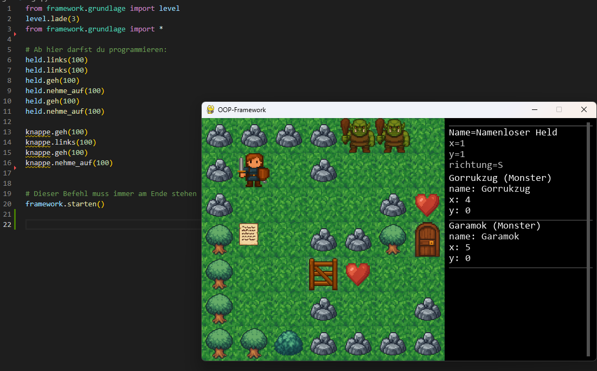
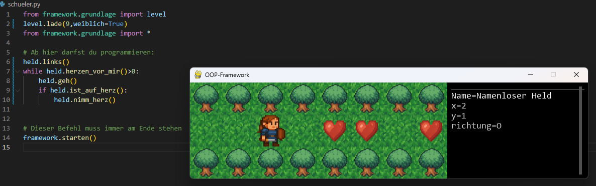
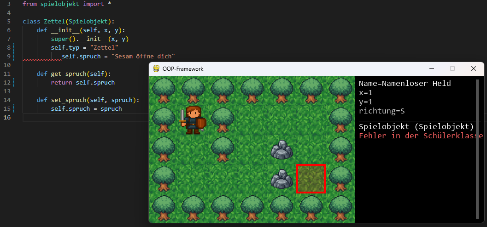
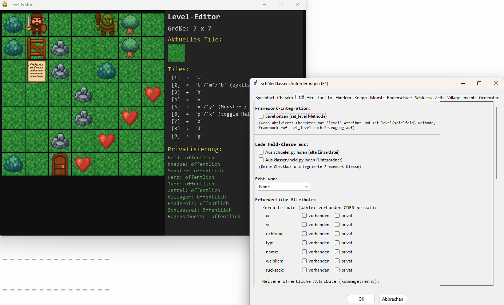

# Projekt OOPventure
# Objektorientierte Programmierung spielerisch lernen

Ein interaktives Lernframework **inkl. Arbeitsmaterial** zum Erlernen **objektorientierter Konzepte** in Python. Schülerinnen und Schüler erstellen Programme und steuern so eine Heldin (oder einen Helden) durch verschiedene Level, um diese zu lösen. Zunächst durch die Verwendung vorgegebener Objekte und derer Methoden, später durch die Implementierung eigener Klassen. Die Programmierung erfolgt in einer beliebigen Python IDE und benötigt keinerlei weitere Installationen oder Bibliotheken.

Klassischerweise werden beim Unterrichten von OOP hauptsächlich Klassen entwickelt und nur testweise Objekte erzeugt. Der Umgang mit Objekten erfolgt dann sehr abstrakt in der Form von Parametern oder Attributen. Mit dem Framework wird diese Vorgehensweise aufgebrochen: Die Schülerinnen und Schüler müssen zuerst mit Objekten und deren Methoden arbeiten, bevor eigene Klassen implementiert werden.

Wichtiger Hinweis: Dieses Projekt wurde mit dem Einsatz von KI-Werkzeugen ermöglicht und umgesetzt. Weitere Informationen dazu sind weiter [unten](#-hinweise-zu-ki-einsatz) zu finden.



## 📚 Übersicht

- [Zielsetzung](#-zielsetzung-und-zweck)
- [Die zwei Phasen](#-die-zwei-phasen)
- [How-To: So wird programmiert](#-how-to-so-wird-programmiert)
- [Klassen implementieren](#-klassen-implementieren-phase-2)
- [Hinweise für Lehrkräfte](#-hinweise-für-lehrkräfte)
- [Installation](#-installation)
- [Lizenz](#-lizenz)
- [Hinweise zu KI-Einsatz](#-hinweise-zu-ki-einsatz)
- [Ausblicke und Weiterentwicklung](#-ausblicke-und-weiterentwicklung)


## 🎯 Zielsetzung und Zweck

Dieses Framework wurde für den Informatikunterricht in der Oberstufe (Leistungskurs) entwickelt, um:

- **Grundlagen der Programmierung** zu vermitteln (Schleifen, Bedingungen, Funktionsaufrufe)
- **Objektorientierte Konzepte** schrittweise einzuführen (Objekte, Attribute, Methoden)
- **Klassendesign** praktisch zu üben (Vererbung, Kapselung, Getter/Setter)
- **Problemlösendes Denken** zu fördern durch immer komplexere Level

Das Framework enthält über 50 Level mit steigendem Schwierigkeitsgrad sowie einen integrierten **Level-Editor** zum Erstellen eigener Aufgaben. Besonderer Wert wurde darauf gelegt, möglichst keinen Overhead zu erzeugen. Zum Einbinden des Frameworks sind nur 4 Zeilen Code notwendig, davon 2 Zeilen nur Importe.

Es bietet sich an, ergänzend zum Material weitere Übungen, insbesondere in Richtung Objektorientiertes Modellieren, anzubieten.

---


## 📚 Die zwei Phasen

### Phase 1: Befehle und Objekte (Level 0–34)

In dieser Phase lernen die Schüler schrittweise:
- Objekte und ihre Methoden kennen
- Einfache Algorithmen mit Schleifen und Bedingungen zu entwickeln
- Objekte zu manipulieren und miteinander interagieren zu lassen
- Über Methodenaufrufe Zugriff auf weitere Objekte zu erhalten
- Getter und setter sowie deren Zweck kennen
- Eigene Objekte zu erzeugen

**Alle Programmierung erfolgt zunächst in der Datei `schueler.py`.**



### Phase 2: Klassen implementieren (Level 35–58)

In dieser Phase implementieren die Schüler eigene Klassen:
- Zunächst einfache Klassen mit öffentlichen Attributen
- Dann Klassen mit privaten Attributen und Getter/Setter (*)
- Schließlich Vererbungshierarchien und komplexe Klassensysteme
- Dabei werden auch Klassenbeziehungen (IST, HAT, KENNT) erläutert
- Außerdem wird das Prinzip der Polymorphie gezeigt und umgesetzt

**Die Klassen werden im Ordner `klassen/` erstellt. In der `schueler.py` werden nur noch die passenden Level geladen.**

(*) Dies wird später wieder rückgängig gemacht, da Vererbung privater Attribute in Python sehr unhandlich ist.



---

## 🎮 How-To: So wird programmiert

### Grundstruktur der `schueler.py`

In der `schueler.py` lösen die Schülerinnen und Schüler die Level 0 bis 34. Über die Leveldateien wird gesteuert, auf welche Objekte sie Zugriff erhalten und ob deren Attribute privat oder öffentlich sind. 

```python
from framework.grundlage import level
level.lade(1, weiblich=False)  # Level-Nummer und Geschlecht des Helden
from framework.grundlage import *

# Ab hier darfst du programmieren:

# ... dein Code hier ...

# Dieser Befehl muss immer am Ende stehen
framework.starten()
```

### Verfügbare Objekte

| Objekt | Beschreibung |
|--------|--------------|
| `held` | Der Spieler-Charakter |
| `knappe` | Ein Begleiter des Spielers |
| `zettel` | Enthält Zaubersprüche  |
| `tuer` | Kann mit Sprüchen oder farbigen Schlüsseln geöffnet werden |
| `tor` | Kann immer geöffnet/geschlossen werden |
| `level` | Das aktuelle Level |
| `monster` | Gegner, die auch angreifen können |

### Befehle für den Helden und Knappen

```python
# Bewegung
held.geh()              # Ein Feld vorwärts gehen
held.links()            # Nach links drehen
held.rechts()           # Nach rechts drehen
held.zurueck()          # Ein Feld rückwärts gehen

# Aktionen
held.nimm_herz()        # Herz aufsammeln
held.ist_auf_herz()     # Prüfen, ob auf einem Herz

# Mit Animationsverzögerung (in Millisekunden)
held.geh(0)           # Schneller gehen für schnelleres Testen
```

### Interaktion mit Objekten

```python
# Zettel und Sprüche
spruch = zettel.gib_spruch()      # Spruch vom Zettel lesen
tuer.spruch_anwenden(spruch)       # Spruch auf Tür anwenden

# Schlüssel und Türen
schluessel = level.gib_objekt_bei(x, y)  # Objekt an Position holen
schluessel.set_farbe("red")              # Farbe setzen
tuer.verwende_schluessel(schluessel)     # Tür mit Schlüssel öffnen

# Objekte vor dem Helden
objekt = held.gib_objekt_vor_dir()       # Objekt vor dem Helden

# Neue Objekte erstellen (ab Level 34)
neuer_schluessel = Schluessel(x, y)
level.objekt_hinzufuegen(neuer_schluessel)
```

### Schleifen und Bedingungen

```python
# For-Schleife
for i in range(10):
    held.geh()
    if held.ist_auf_herz():
        held.nimm_herz()

# While-Schleife
while not held.ist_auf_herz():
    held.geh()
```

---

## 🏗️ Klassen implementieren (Phase 2)

Ab Level 35 müssen eigene Klassen erstellt (zunächst innerhalb der `schueler.py`) und ab Level 38 im Ordner `klassen/` in eigene Dateien ausgelagert werden. Ab diesen Leveln wird automatisch die Schülerklasse verwendet, wobei das Rendering und Teile der Spiellogik (z.B. Tastatursteuerung) weiterhin vom Framework übernommen werden. In den Leveldateien ist festgelegt, wie die Klassen zu implementieren sind. Um ein Level zu lösen, muss die Implementierung nach den Vorgaben erfolgen.

### Beispiel: Einfache Held-Klasse (Level 38)

```python
# Datei: klassen/held.py
class Held:
    def __init__(self, x, y, richtung, weiblich):
        self.x = x
        self.y = y
        self.richtung = richtung
        self.weiblich = weiblich
        self.name = "Namenloser Held"
        self.typ = "Held"
```

### Beispiel: Klasse mit privaten Attributen (Level 40+)

```python
# Datei: klassen/held.py
class Held:
    def __init__(self, x, y, richtung, weiblich):
        self.__x = x
        self.__y = y
        self.__richtung = richtung
        self.__weiblich = weiblich
        self.__name = "Held"
        self.__typ = "Held"
    
    def get_x(self):
        return self.__x
    
    def set_x(self, wert):
        self.__x = wert
    
    # ... weitere Getter und Setter
```

### Beispiel: Vererbung (Level 50+ , Attribute nicht mehr privat für bessere Lesbarkeit)

```python
# Datei: klassen/spielobjekt.py
class Spielobjekt:
    def __init__(self, x, y):
        self.x = x
        self.y = y
    
    def get_x(self):
        return self.x

# Datei: klassen/hindernis.py
from spielobjekt import Spielobjekt

class Hindernis(Spielobjekt):
    def __init__(self, x, y, typ):
        super().__init__(x, y)
        self.typ = typ
```

---

## 👩‍🏫 Hinweise für Lehrkräfte

Im Ordner Material ist vollständiges Unterrichtsmaterial für den Leistungskurs enthalten. Im Ordner LSG befinden sich Musterlösungen und weitere Test-Dateien für alle Level.

### Enthaltene Werkzeuge

| Datei/Ordner | Beschreibung |
|--------------|--------------|
| `leveleditor.py` | Grafischer Level-Editor zum Erstellen und Bearbeiten von Levels |
| `run_tests_gui.py` | Test-Runner mit grafischer Oberfläche für alle Level |
| `make_distribution.py` | Erstellt ein ZIP-Archiv für die Verteilung an Schüler |
| `lsg/` | Musterlösungen für alle Level (lsg1.py bis lsg57.py) |
| `Material/` | Zusätzliches Unterrichtsmaterial |
| `docs/` | Technische Dokumentation |

### Level-Editor



Der Level-Editor (`leveleditor.py`) ermöglicht:
- Einfaches Erstellen neuer Level
- Konfiguration von Siegbedingungen
- Definition von Klassenanforderungen für Phase 2
- Export und Import von Level-Dateien


### Test-Runner

Der Test-Runner (`run_tests_gui.py`) führt automatisch alle Musterlösungen aus und prüft, ob die Level korrekt gelöst werden:


### Schüler-Distribution erstellen

Um ein Schüler-Paket zu erstellen, das nur die benötigten Dateien enthält, also keine Lösungen, kein Test-Runner, usw., kann die `make_distribution.py` verwendet werden.

Dies erstellt ein ZIP-Archiv im `dist/`-Ordner. Eine aktuelle Version ist jedoch auch immer hier im Repository verfügbar.

### Ordnerstruktur

```
oop_framework/
├── schueler.py          # Hier programmieren die Schüler
├── leveleditor.py       # Level-Editor
├── framework/           # Framework-Code (nicht verändern!)
├── klassen/             # Schüler-Klassen für Phase 2
├── level/               # Level-Dateien (JSON)
├── sprites/             # Grafiken
├── lsg/                 # Musterlösungen
├── Material/            # Unterrichtsmaterial
├── tests/               # Automatische Tests
└── docs/                # Dokumentation
```

---

## 🚀 Installation

1. Framework Distribution herunterladen (aktuell 1.0) und entpacken
2. `schueler.py` mit beliebiger Python IDE öffnen, bearbeiten und ausführen

**Alternativ**:
1. Repository herunterladen und anpassen
2. Mit `make_distribution.py` eine eigene Distribution erzeugen.

---

## 🔮 Ausblicke und Weiterentwicklung

- In der aktuellen Fassung bildet das Framework den saarländischen Lehrplan vollständig ab. Es sind jedoch noch einige Fehler vorhanden, die insbesondere dann auftreten, wenn falsche oder unvollständige Lösungen der Schülerinnen und Schüler vorliegen.

- Die Grafiken sollen vollständig durch handgezeichnete Grafiken ersetzt werden

- Weitere Spielobjekte sollen integriert werden, welche nicht von normalen Spielobjekten abgeleitet werden können, um interessantere und komplexere Aufgabenstellungen zu ermöglichen. Über den Leveleditor sind bereits Dorfbewohner und Questgeber verfügbar, diese sind jedoch noch nicht korrekt implementiert.

- Arbeitsblätter 2 und 3 müssen vollständig überarbeitet werden. Das gesamte Unterrichtsmaterial befindet sich derzeit in Version 1.

---

## 📝 Lizenz

**Bildungslizenz für OOPventure**

Copyright © 2025 Johannes Harz, Cusanus Gymnasium St. Wendel
CC BY-NC-SA 4.0

### Erlaubnisse:

1. ✅ **Schulische Nutzung**: Dieses Framework darf frei für schulische und Bildungszwecke verwendet werden
2. ✅ **Weitergabe**: Das Projekt darf kopiert und weitergegeben werden
3. ✅ **Anpassung**: Level und Unterrichtsmaterial dürfen angepasst werden
4. ✅ **Namensnennung**: Bei Weitergabe muss der Urheber genannt werden

### Einschränkungen:

1. ❌ **Keine kommerzielle Nutzung**: Das Framework darf nicht verkauft oder kommerziell verbreitet werden
2. ❌ **Keine Haftung**: Das Framework wird "wie besehen" bereitgestellt, ohne Gewährleistung
3. ✅ **Weitergabe unter gleichen Bedingungen**: Angepasste Versionen müssen unter denselben Lizenzbedingungen veröffentlicht werden

### Kontakt:

Für kommerzielle Anfragen oder spezielle Nutzungsrechte kontaktieren Sie bitte:  
Johannes Harz - [j.harz@schule.saarland]

---

## 🤖 Hinweise zu KI-Einsatz

Dieses Projekt wurde teilweise mit Unterstützung von KI-Werkzeugen entwickelt:

- **Mit KI erstellt**: Die Grafiken (Sprites, Icons) und große Teile des Framework-Codes wurden mithilfe von KI-Tools generiert und angepasst
- **Ohne KI erstellt**: Das pädagogische Konzept, die Aufgabenstellungen und das gesamte Lernmaterial wurden ohne KI-Unterstützung entwickelt
- **Geplante Änderung**: Die aktuellen Grafiken sollen in Zukunft durch Schülerarbeiten ersetzt werden, um das Projekt noch authentischer und schülernäher zu gestalten

